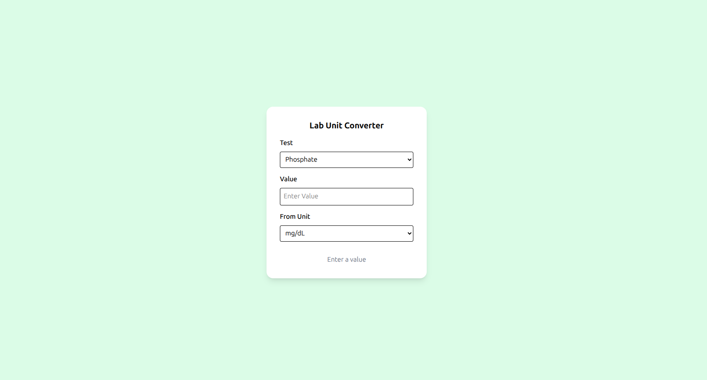
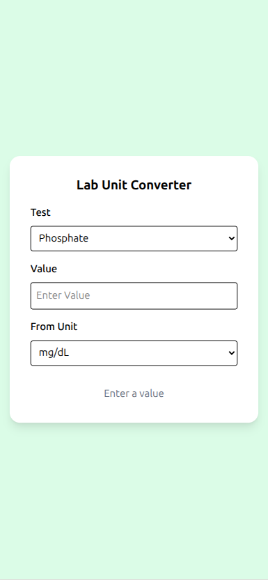

Here’s a clean **production-ready `README.md`** you can drop straight into your repo before deploying to GitHub + Netlify.

It’s structured so you can improve it later without rewriting everything.

---

# 📘 `README.md`

````md
# 🧪 Lab Unit Converter (PWA)

A lightweight, installable **Progressive Web App (PWA)** for converting laboratory test units and interpreting results.

Designed for fast clinical-style calculations, offline use, and mobile-first access.

---

## 🚀 Live Demo

> Add your Netlify link here after deployment  
Example:  
`https://your-app-name.netlify.app`

---

## ✨ Features

- 🔬 Convert lab values between medical units
- 📊 Reference range interpretation (Normal / Low / High / Critical)
- ❤️ Cholesterol / HDL ratio calculator
- 📱 Installable as a PWA (works like a native app)
- 📴 Offline support via Service Worker
- ⚡ Fast, lightweight UI (Tailwind CSS)
- 💾 Works without backend

---

## 🧠 Supported Tests

- Phosphate
- Magnesium
- Uric Acid
- Cholesterol / HDL Ratio

---

## 🛠 Tech Stack

- HTML5
- JavaScript (ES Modules)
- Tailwind CSS
- Service Workers (PWA)
- Web App Manifest

---

## 📦 Installation (Local Dev)

```bash
git clone https://github.com/your-username/lab-unit-converter.git
cd lab-unit-converter
````

Then open with Live Server:

```bash
npx live-server
```

or simply open:

```
index.html
```

---

## 📲 PWA Installation

On supported browsers:

1. Open the app in Chrome or Edge
2. Click **Install App** button (top right)
3. Use it like a native mobile/desktop app

---

## 🧪 How It Works

1. Select a lab test
2. Enter value + unit
3. App converts to standard unit
4. Shows:

   * Converted value
   * Reference range comparison
   * Clinical interpretation

For Chol/HDL:

* Enter Total Cholesterol
* Enter HDL
* App calculates ratio automatically

---

## 📂 Project Structure

```
.
├── index.html
├── js/
│   ├── script.js
│   ├── state.js
│   ├── data.js
│   ├── ui.js
│   ├── conversions.js
├── src/
│   └── output.css
├── icons/
├── manifest.json
├── service-worker.js
└── README.md
```

---
## 📸 Screenshots

### 💻 Desktop View


### 📱 Mobile View


## 🌐 Deployment

### 🔵 Netlify (Recommended)

1. Push project to GitHub
2. Go to [https://netlify.com](https://netlify.com)
3. Click **"Add New Site" → Import from GitHub**
4. Select repo
5. Set:

   * Build command: *(leave empty)*
   * Publish directory: `/`

Done ✔️

---

### 🟢 GitHub Pages (Alternative)

1. Go to repo settings
2. Enable **Pages**
3. Select branch: `main`
4. Root folder `/`

---

## ⚙️ PWA Features

* Install prompt (beforeinstallprompt API)
* Offline caching via Service Worker
* Update notification system
* Standalone app mode detection

---

## 🧭 Roadmap (Future Improvements)

* 📈 Graph visualization of reference ranges
* 🧠 AI-based interpretation of lab results
* 📊 History tracking of previous inputs
* 🔔 Smart alerts for critical values
* 🌙 Dark mode support
* 🌍 Multi-language support
* 📱 Enhanced mobile UI layout

---

## ⚠️ Disclaimer

This tool is for **educational and reference purposes only**.
It should not replace professional medical judgment or laboratory systems.

---

## 👨‍💻 Author

Built by Wako (and improved iteratively with ChatGPT 🚀)

---

## 📄 License

MIT License
